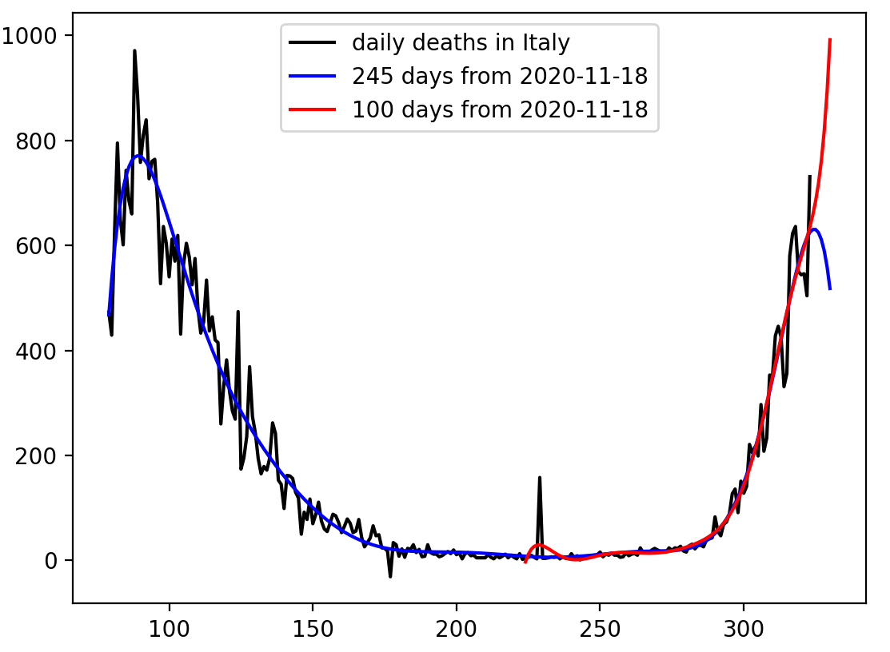

# italy

The latest data should be downloaded from:
 https://covid.ourworldindata.org/data/ecdc/new_deaths.csv
 
 Prediction is based on the curve fitting with 10th degree polinomial: np.polyfit(x[valid],y[valid],10).
 
 Blue line is the predicted curve using the last 245 days from Nov. 18 in 2020. Red line is that using the last 100 days from Nov.18 in 2020. Black line shows the number of daily deaths due to the covid-19 from Dec. 31 in 2019 to Nov.18 in 2020.
 
 
 
